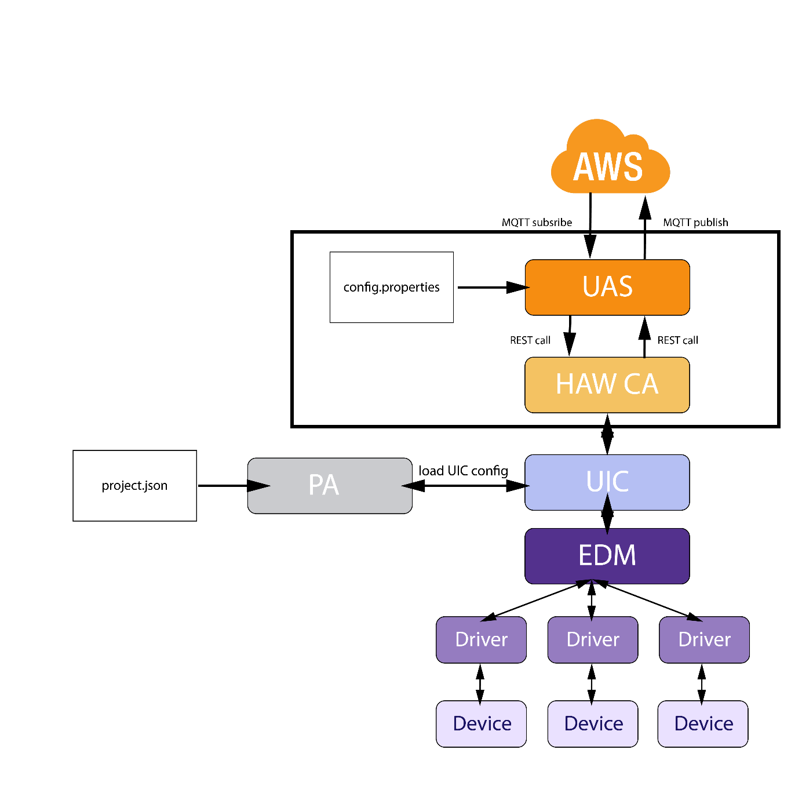

HAW Communication Agent
======================

The repository contains the HAW Communication Agent implementing the functionality of the UIC
to connect to Amazon Websevice. The HAW Communicaiton Agent supports the functionality to send device data  to the AWS 
cloud, receive data from it and and hand it down to the device, which is able to display the received data.

## Table of content

- [Architecture Overview](#overview)
- [Installation & Setup](#installation)
    - [HAW Communication Agent](#extension)
    - [UIC AWS Connection Server](#database)
- [Page setup](#page-setup)
    - [Upload the page tree file](#upload-the-page-tree-file)
    - [Go to the import view](#go-to-the-import-view)
    - [Import the uploaded page tree file](#import-the-uploaded-page-tree-file)
- [License](#license)
- [Links](#links)

## Architecture Overview
The following image shows the architecture of the system, which the HAW Communication Agent was integrated in. AWS currently
doesn't support .NET and therefore is not offering a library, which is able to handle the MQTT-protocol between AWS and
a .NET client. Therefore a Java workaround is used as an interface between the actual HAW CA and AWS, because Java is 
supported via libraries by AWS.

The three main parts of the HAW Communication Agent is displayed in the black rectangle of the following image. 
These parts are:
- UIC AWS Connection Server
- HAW Communication Agent
- config.properties

## Installation and Setup

### HAW Communication Agent

### UIC AWS Connection Server