HAW Communication Agent
======================

The repository contains the HAW Communication Agent implementing the functionality of the UIC
to connect to Amazon Webservice. The HAW Communication Agent supports the functionality to send device data  to the AWS
cloud, receive data from it and hand it down to the device, which is able to display the received data.

## Table of content

- [Architecture Overview](#architecture-overview)
- [Installation and Setup](#installation-and-setup)
    - [Recommendations](#recommendations)
    - [UIC AWS Connection Server](#uic-aws-connection-server)
    - [HAW Communication Agent](#haw-communication-agent)
    - [Configurations](#configurations)
          - [Configuration of the UAS](#configuration-of-the-uas)
          - [Configuration of the HAW CA](#configuration-of-the-haw-ca)
- [Start](#start)
- [FAQ](#faq)
- [License](#license)


## Architecture Overview
The following image shows the architecture of the system, which the HAW Communication Agent was integrated in. AWS currently
doesn't support .NET and therefore is not offering a library, which is able to handle the MQTT-protocol between AWS and
a .NET client. Therefore a Java workaround is used as an interface between the actual HAW CA and AWS, because Java is
supported via libraries by AWS.

The three main parts of the HAW Communication Agent is displayed in the black rectangle of the following image.
These parts are:
- UIC AWS Connection Server
- HAW Communication Agent
- Configurations


## Installation and Setup

The installation of the HAW CA consists of simple steps, which are displayed on the following lines.
Basically you have to setup two environments: The Communication Agent and the UIC AWS Connection Server.
Let's first take a look at the recommended software for the installation.

## Recommendations
To guarantee an optimal installation process it is recommended to use the tools, which were used in writing the HAW CA. The following instructions are based upon the use of these tools.

The following tools were used:
- [Windows 10](https://www.microsoft.com/de-de/windows)
- [Visual Studio 2017 IDE](https://visualstudio.microsoft.com/vs/)
- [IntelliJ IDE](https://www.jetbrains.com/idea/)
- [Java SE Development Kit 1.8](https://www.java.com/)

### UIC AWS Connection Server

To import the project in your system start the IntelliJ IDE. A prompt should ask you to either to create a new project or import an existing one. Choose "Import Project" and select the \AWS_CA\java folder of the cloned repository.

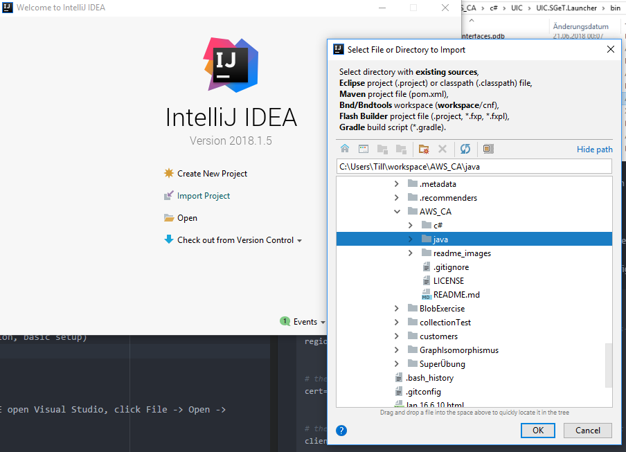

As this java component is a maven project you have to import it as a maven project by choosing "import project from external model" and then choosing Maven. Then click "Next".

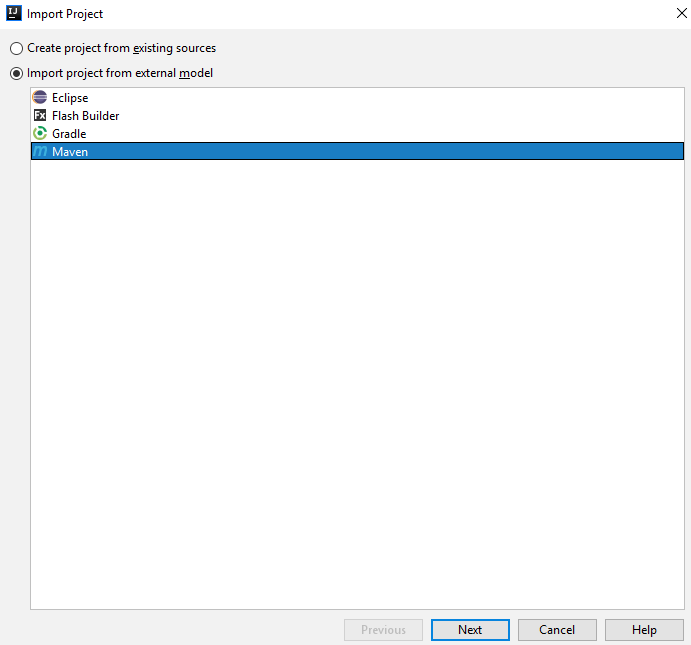

Check that the settings of your project resemble the ones of the following image.

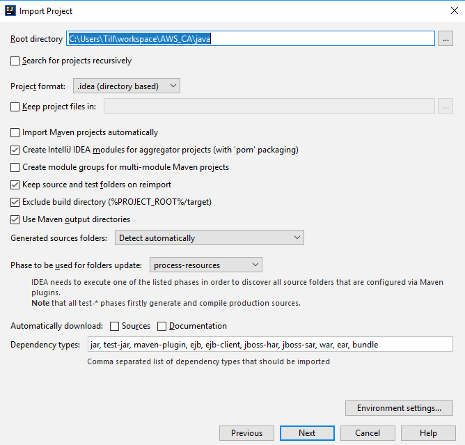

Next.

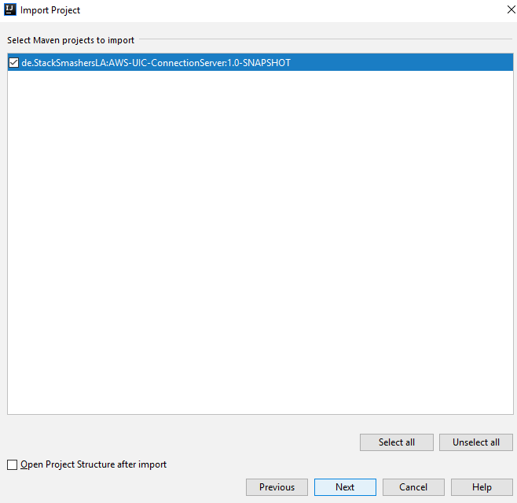

Finish.

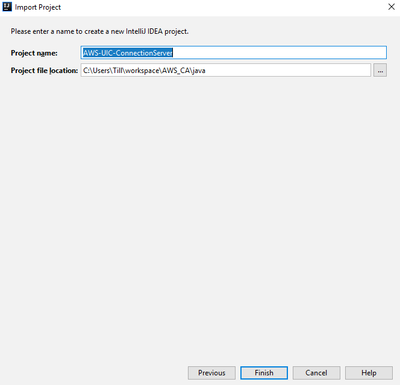

The maven project should now be imported by IntelliJ. This may take a while.

When the Maven project is imported open the Maven Projects explorer.
To compile the UAS select "Execute Maven goal" in Maven Projects explorer.

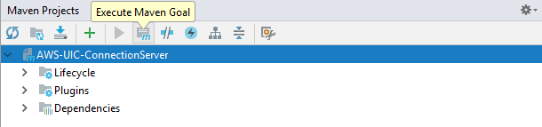

Now write "package" in the Command line and press "Execute". This will build the required .jar file to launch the UAS, which can be found under the target folder.

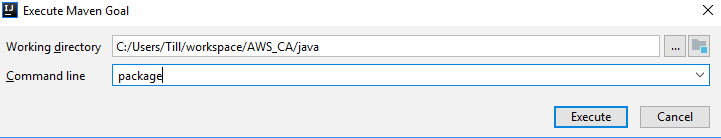

Note: Before starting the UAS make sure the config.properties file is defined as display under [configuration of the UAS](config\.properties-of-the-uas).

To start the UAS start the AWS-UIC-ConnectionServer-1.0-SNAPSHOT.jar by double-clicking on it on your system's explorer.

### HAW Communication Agent

To open the Communication Agent in the Visual Studio IDE open Visual Studio, click File -> Open -> project map or use CTRL+SHIFT+O.

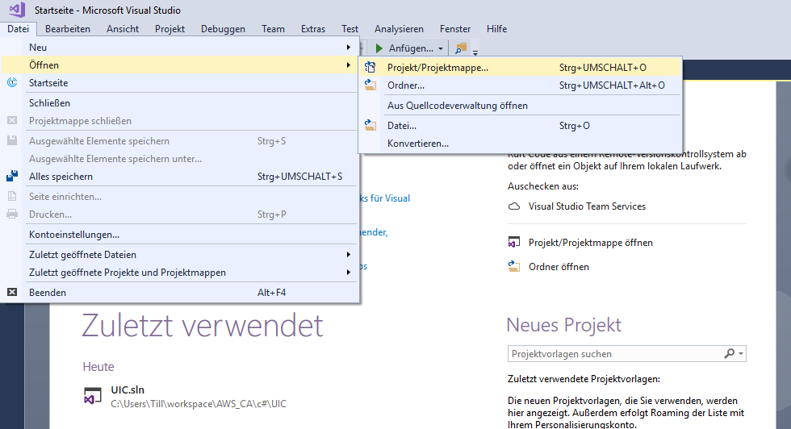

In the opening dialog navigate in the UIC directory \AWS_CA\c#\UIC.

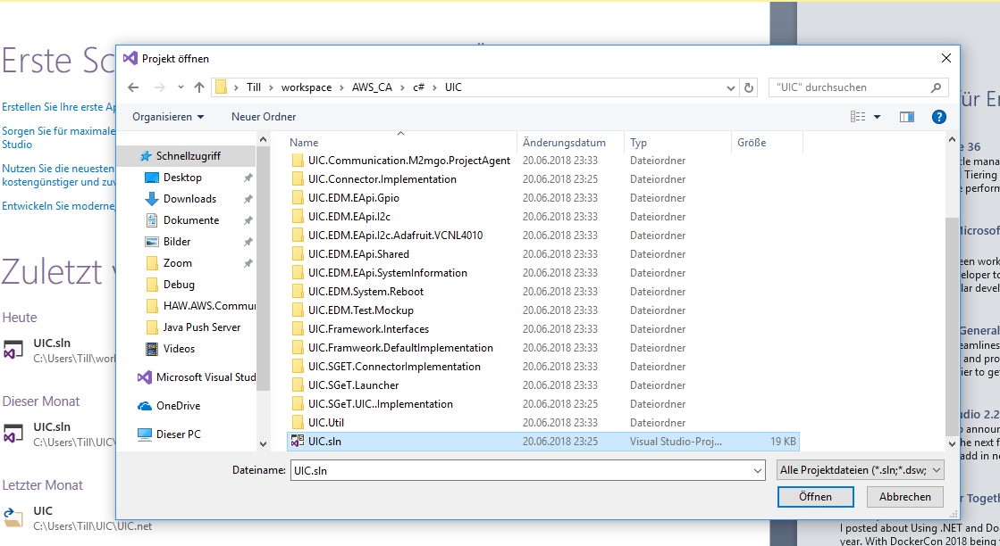

This should open the project in Visual Studio. On the right side of the IDE you can see the project map
explorer. The following projects are used for the HAW Communication Agent:
- HAW.AWS.CommunicationAgent (The implementation of the CA)
- AWSCommunicationAgent (The interface for the Communication Agent)
- UIC.SGeT.Launcher (The launcher of the communication agents)

To compile the HAW Communication Agent you have to build the UIC.SGeT.Launcher by right-clicking on it in the project explorer and choosing the build option in the context menu.

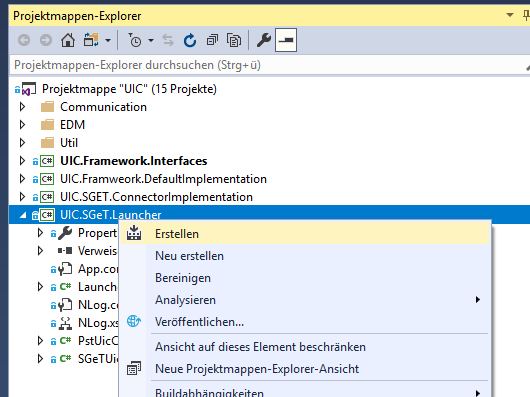

Visual Studio will now build the launcher, which may take some time. After the building is done you can find the executable in AWS_CA\c#\UIC\UIC.SGeT.Launcher\bin\Debug in your system's explorer.

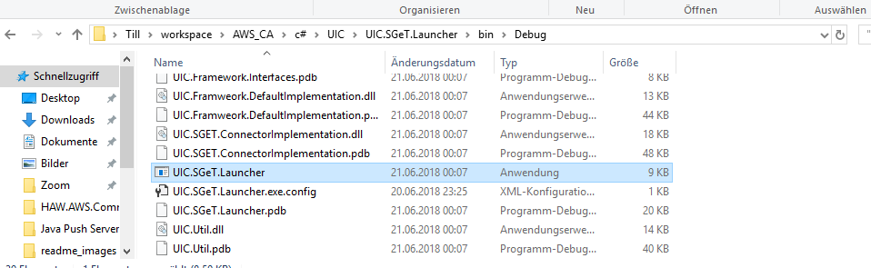  

Note: Before starting the HAW CA make sure the config.properties file is defined as displayed under [Configuration of the HAW CA](configuration-of-the-haw-ca).

Start the launcher by double-clicking the executable file. An terminal should open and provide information about the activities of the HAW CA.

###  Configurations

To start the HAW Communication Agent two configuration files have to be specified. One for the HAW CA and one for the UAS.

#### config.properties of the UAS
The config.properties of the UAS has to be created in the same folder of the .jar file. (default after compilation: "\AWS_CA\CA\target")

``` python
# \AWS_CA\java\sample-configuration\config.properties

# The region of the aws server that is used (f.e. server: data.iot.us-west-2.amazonaws.com => region: us-west-2)
region=us-west-2


# the certificate file generated in the AWS Certificate Manager.
cert=INSERT_CERTIFICATE_FILENAME


# the ClientID for this Instance. MUST be unique in the whole project
clientid=CHANGEME123


# The praefix of the aws server that is used (f.e. server: data.iot.us-west-2.amazonaws.com => prasefix: data   )
praefix=data


# the file that contains the private key of the certificate
private_key_file=INSERT_PRIVATE_KEY_FILENAME


# the quality of service that is sued for publishes
qos=1


# true: a certification is used for authentication (only way implemented yet)
usecert=true


# the topic that is used for pushing data such as Attributes and DataPoints
# CAN be overwritten in the http-post-request
push_topic=myProject/push


# the topic that is used for the Initiation
# CAN be overwritten in the http-post-request
init_topic=myProject/init


# the topic that is used for the subscription and the backchannel feature
backchannel_topic=myProject/back


# the url for the REST API of the UIC (default: localhost:8081/backchannel)
backchannel_url=http://localhost:8081/backchannel

# the algorithm of the certificate (not needed)
# algorithm_cert=

# the file that contains the public key of the certificate(not needed)
# public_key_file=
```

#### Configuration of the HAW CA

After compiling the HAW CA you have to create a config.properties file in the path of "AWS_CA\c#\UIC\UIC.SGeT.Launcher\bin\Debug". In this configuration the ports are set by which the HAW CA communicates with the UAS.

``` python
# port for the REST API of the uic
port_uic = 8081

# port for the REST API of the UIC-AWS-ConnectionServer
port_uas = 8080
```


## Start

To stat the HAW CA follow the steps below:
1. Start the UAS by double-clicking the .jar file found in AWS_CA\java\target
2. Start the HAW CA by double-clicking the .exe file found in AWS_CA\c#\UIC\UIC.SGeT.Launcher\bin\Debug

## FAQ
#### How to compile the HAW Communication Agent?
Please follow the instructions shown under [HAW Communication Agent](#haw-communication-agent). Basically you have to import the .NET project into Visual Studio and compile the "UIC.SGeT.Launcher.csproj" by right-clicking on it and choosing the build option.

#### Where do I find the executable file to start the HAW Communication Agent?
The HAW CA executable can be found under AWS_CA\c#\UIC\UIC.SGeT.Launcher\bin\Debug. The file you need to start is called UIC.SGeT.Launcher

#### The configuration can't be loaded. How do I solve this problem?
As you compile the HAW Communication Agent please make sure to choose the right processor architecture. If Any is selected you definitely have to adjust the option to your processor architecture.

#### Which configurations are used to change local setting?
- uic_config.json
- project.json

#### Is there anything to change in those files?
Make sure that in the uic_config.json the value "ProjectJsonFilePath" is set to the path of the project.json.

Also, "IsRemoteProjectLoadingEnabled" has to be set false.

#### Is it possible to use a UNIX operating system to work on the HAW CA?
Yes, the Microsoft .Net Framework can be used. Differences between the windows and the unix version may occur. Therefore we recommend to stick with using Visual Studio in Windows because it was used in the development process.

## license

[](http://badges.mit-license.org)
- **[MIT license](http://opensource.org/licenses/mit-license.php)**
- Copyright 2018 © Daniel Krüger, Sebastian Niksch, Michael Klemmer, Till Seeberger.
